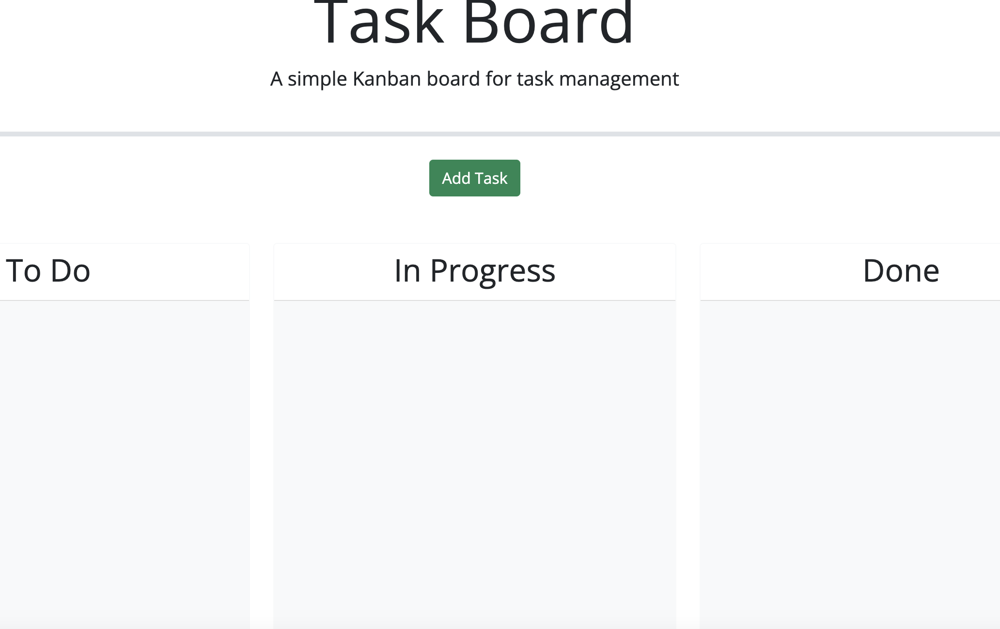

# 1. API-task-board

### Hello everyone, I welcome you to my project that will help you organize your daily task.

# Description 

### For this project the user will be able to organize any task based on three categories. The three categories are to-do, in progess and finised. Allowing the user to know what task need to be done, in progress or finished. When organizing the task they can include a name title, date and a description of the task. 

# 2. User Story

-AS A marketing student,
-I WANT a personal blog
-SO THAT I can showcase my thoughts and experiences.

# 3. How to Use

### This website is intended to be user friendly. The user will begin by clicking the green Add Task button. Then a pop up window will be displayed with three options that must be filled out. These options are Task Name, Task Description and Due Date. When the user clicks on Add Task then the task will appear as a card. You can then drag the task at its appropriate column. Depending on what column you choose the card will turn a red, blue or green color.

# 4. Deployment

## https://github.com/jesse437/API-task-board

# 5. Visuals

# 6. Collaborators

[Jesus Ruiz Gutierrez](https://github.com/jesse437)

# 7. Technologies Used

- HTML, CSS, JavaScript and APIs